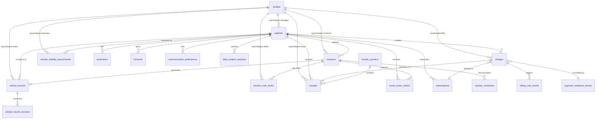

# Data Architecture: Talitha Psicologia

**Versao:** 1.9
**Data:** 2026-09-09
**Referencia:** `docs/talitha-architecture.md` (v1.1, secao 17), `docs/talitha-security-review-architecture.md` (secao 4), `docs/talitha-security-review-schema.md` (patches A1-A4, M1, B1-B2, R19), `docs/talitha-security-review-prd.md`, `docs/talitha-prd.md` (emendas E1-E8), `docs/adr/ADR-0001..0006`, `CLAUDE.md`, `docs/decisions.md`

---

## Diagrama de Entidades (Mermaid)



---

## Tabelas

### 1. profiles

**Proposito:** Perfil do usuario vinculado a `auth.users`. `role` e a fonte canonica de autorizacao, espelhada em `app_metadata` por trigger.

**Classificacao LGPD:** D6 (Interno), D15/D16 (Publico/Confidencial para psicologa)
**Retencao:** Vida da conta

**Colunas:** id (UUID PK = auth.users.id), role (TEXT NOT NULL CHECK), full_name, email, phone, crp, crp_region, specialty, default_session_value, cancellation_policy_hours, cpf_ciphertext..cpf_kek_version (envelope, psicologa), onboarding_completed, created_at, updated_at.

**E5:** Coluna `epsi_status` REMOVIDA (plataforma e-Psi desativada 31/08/2024, Res. CFP 09/2024). CRP ativo continua obrigatorio.

**Protecoes:**
- Trigger `trg_profiles_protect_role` impede UPDATE de role por qualquer usuario
- B2: Trigger `trg_profiles_protect_psychologist_columns` impede paciente de alterar colunas da psicologa (crp, specialty, default_session_value, etc.)
- Trigger `trg_profiles_sync_role_metadata` espelha role em `app_metadata` (SECURITY DEFINER)
- A4: REVOKE ALL table-level + GRANT SELECT/UPDATE column-level (colunas de CPF cifrado inacessiveis via browser)

### 2. patients

**Classificacao LGPD:** D5 (Confidencial - CPF), D6 (Interno)
**Retencao:** 5 anos apos `treatment_ended_at` (Emenda E1)

**Constraints criticas:**
- `CHECK (date_of_birth <= current_date - interval '18 years')` (Requisito 18)
- `cpf_hmac UNIQUE` (blind index HMAC-SHA256 chaveado)
- A2: Trigger `trg_patients_set_retention` auto-calcula `retention_until = treatment_ended_at + 5 years` e impede reducao manual
- A2: `fn_block_delete_patient_retention` bloqueia DELETE quando `treatment_ended_at IS NOT NULL AND retention_until IS NULL` (safety net)
- A4: REVOKE ALL table-level + GRANT SELECT column-level (colunas cifradas inacessiveis)
- `asaas_customer_id TEXT UNIQUE` — ID opaco do Asaas (D11 Interno, sem cifra). Escrito por service_role (Edge Function). Excluido do GRANT SELECT (browser nao precisa). Eliminavel por LGPD (R20).

### 3. sessions

**Protecoes (Requisito 6 - AC2):**
- REVOKE UPDATE/INSERT/DELETE FROM authenticated, anon
- RPCs: enter_waiting_room, admit_patient, cancel_session
- Trigger regenera room_name na remarcacao

### 4. clinical_records

**Envelope encryption (7 colunas).** AAD = `patient_id|record_id`.

**RLS (Requisito 28):** Nenhuma policy concede SELECT a patient. aal2 obrigatorio. A4: colunas de ciphertext inacessiveis via browser; INSERT/UPDATE concedidos table-level para Server Actions que escrevem ciphertext.

### 5. clinical_record_versions

**M1:** Append-only enforced por triggers `trg_clinical_record_versions_no_update` e `trg_clinical_record_versions_no_delete` (fecha Requisito 12).

### 6. anamnesis

Paciente: INSERT/UPDATE/SELECT propria (ciphertext REVOKEd). Psicologa: SELECT com aal2. Retention trigger ativo.

### 7. session_note_drafts

SO psicologa, aal2. DELETE pela psicologa ao salvar evolucao.

### 8. charges

Maquina de estados monotonica (trigger). Status: pending_creation, pending, overdue, paid, refunded, chargeback, cancelled.

### 9. subscriptions

Maquina de estados monotonica (trigger, como charges). Status: `pending_creation` (default), `active`, `paused`, `cancelled`, `creation_failed`.

```
pending_creation -> active | creation_failed
active -> paused | cancelled
paused -> active | cancelled
creation_failed -> (terminal — retry cria nova linha)
cancelled -> (terminal — retry cria nova linha)
```

UNIQUE parcial: `WHERE status IN ('pending_creation', 'active', 'paused')` — linhas mortas (cancelled, creation_failed) nao bloqueiam nova assinatura.

`asaas_customer_id` nao vive aqui: e atributo do paciente (`patients.asaas_customer_id`, migration 18). A subscription referencia o paciente, e o paciente carrega o customer ID.

### 10-12. payment_webhook_events, receipt_counters, receipts

Webhook sem payload bruto. Contador transacional (FOR UPDATE). Receipts UNIQUE(charge_id).

### 13. consents

**A3:** Append-only enforced por 3 triggers (UPDATE, DELETE, TRUNCATE) + FORCE ROW LEVEL SECURITY + REVOKE UPDATE/DELETE/TRUNCATE FROM service_role. Mesmo rigor do audit_log.

**E7:** Finalidades e versionamento por hash ja acomodam clausulas de formato online, politica de faltas e queda de conexao sem alteracao de schema. Quando o texto do termo muda, `consent_version` incrementa e `consent_text_hash` muda; pacientes devem re-aceitar.

### 14-16. communication_preferences, email_action_tokens, data_subject_requests

**R19:** `email_action_tokens` agora acessado via RPC `consume_email_token` que valida expiracao, uso unico e purpose match atomicamente (fecha Requisito 19).

### 17-18. session_reminders, billing_rule_events

UNIQUE constraints de banco para idempotencia.

### 19. audit_log

4 camadas. **A1:** `log_audit` agora valida role e ownership — paciente so pode logar acoes sobre si mesmo, psicologa so sobre seus pacientes. Impede injecao de entradas fabricadas no log de compliance.

### 20. remote_viability_assessments (NOVA — E6)

**Proposito:** Res. CFP 09/2024 exige que a avaliacao de viabilidade do atendimento remoto seja registrada no prontuario, com data. Este registro protege a psicologa perante o CRP.

**Classificacao LGPD:** D1 (Sensivel-LGPD — conteudo clinico)
**Retencao:** 5 anos (mesma retencao do prontuario)

**Modelagem como tabela separada (nao extensao de clinical_records):**
1. Ciclo de vida diferente: um por paciente com versionamento, nao um por sessao
2. Append-only independente — misturar com clinical_records exigiria session_id nullable ou discriminador, enfraquecendo o modelo
3. RLS e retencao proprias, mesmo padrao das tabelas clinicas

**Colunas:** id (UUID PK), patient_id (FK), psychologist_id (FK), version_number (INT, UNIQUE com patient_id), is_viable (BOOLEAN NOT NULL), content_ciphertext..kek_version (7 colunas envelope, AAD = patient_id|assessment_id), assessed_at (TIMESTAMPTZ), retention_until, created_at.

**Protecoes:** Append-only (triggers bloqueiam UPDATE/DELETE). Retention trigger. RLS: psicologa com aal2 apenas. Nenhuma policy para patient. A4: colunas cifradas inacessiveis via browser.

**E8:** Nenhum CHECK, enum ou trigger bloqueia caso por elegibilidade clinica. O campo `is_viable` e um registro da decisao da psicologa, nao um gate automatico. A decisao e clinica.

---

## RLS Policies — Matriz (v1.1)

| Tabela | SELECT | INSERT | UPDATE | DELETE |
|--------|--------|--------|--------|--------|
| **profiles** | Psicologa: todas; Paciente: propria + psicologa | Nenhuma (service_role) | Proprio (exceto role, B2: exceto colunas de psicologa) | Nenhuma |
| **patients** | Psicologa: todas; Paciente: propria | Nenhuma | Nenhuma | Nenhuma (trigger) |
| **sessions** | Psicologa: suas; Paciente: suas | Nenhuma (REVOKE) | Nenhuma (REVOKE) | Nenhuma (REVOKE) |
| **clinical_records** | Psicologa: aal2 | Psicologa: aal2 | Psicologa: aal2 | Nenhuma |
| **clinical_record_versions** | Psicologa: aal2 | Psicologa: aal2 | Nenhuma (trigger) | Nenhuma (trigger) |
| **anamnesis** | Psicologa: aal2; Paciente: propria | Paciente: propria | Paciente: propria | Nenhuma |
| **session_note_drafts** | Psicologa: aal2 | Psicologa: aal2 | Psicologa: aal2 | Psicologa: aal2 |
| **remote_viability_assessments** | Psicologa: aal2 | Psicologa: aal2 | Nenhuma (trigger) | Nenhuma (trigger) |
| **charges** | Psicologa; Paciente: proprias | Nenhuma | Nenhuma | Nenhuma |
| **subscriptions** | Psicologa; Paciente: proprias | Nenhuma | Nenhuma | Nenhuma |
| **payment_webhook_events** | Nenhuma | Nenhuma (service_role) | Nenhuma | Nenhuma |
| **receipt_counters** | Nenhuma | Nenhuma | Nenhuma | Nenhuma |
| **receipts** | Psicologa; Paciente: proprios | Nenhuma | Nenhuma | Nenhuma |
| **consents** | Psicologa; Paciente: proprios | Paciente: proprios | Nenhuma (trigger) | Nenhuma (trigger) |
| **communication_preferences** | Psicologa; Paciente: proprio | Nenhuma | Paciente: proprio | Nenhuma |
| **email_action_tokens** | Nenhuma | Nenhuma | Nenhuma | Nenhuma |
| **data_subject_requests** | Psicologa; Paciente: proprios | Paciente: proprios | Nenhuma | Nenhuma |
| **session_reminders** | Psicologa: de suas sessoes | Nenhuma | Nenhuma | Nenhuma |
| **billing_rule_events** | Psicologa: de suas charges | Nenhuma | Nenhuma | Nenhuma |
| **audit_log** | Psicologa: todos | Nenhuma (funcao SD) | Nenhuma (trigger+REVOKE) | Nenhuma (trigger+REVOKE) |

---

## Triggers e Functions (v1.1)

| Trigger / Function | Tabela | Evento | O que faz |
|---|---|---|---|
| `fn_update_timestamp` | -- | -- | Generica: `NEW.updated_at = now()` |
| `fn_profiles_protect_role` | profiles | BEFORE UPDATE | Impede alteracao de role |
| `fn_profiles_protect_psychologist_columns` | profiles | BEFORE UPDATE | B2: impede paciente de alterar colunas da psicologa |
| `fn_profiles_sync_role_metadata` | profiles | AFTER INSERT/UPDATE OF role | Espelha role em app_metadata (SD) |
| `fn_sessions_on_reschedule` | sessions | BEFORE UPDATE | Regenera room_name, zera waiting/admitted |
| `fn_charges_monotonic_status` | charges | BEFORE UPDATE OF status | Impede regressao de status |
| `fn_subscriptions_monotonic_status` | subscriptions | BEFORE UPDATE OF status | Maquina de estados monotonica para assinaturas |
| `fn_patients_set_retention` | patients | BEFORE UPDATE | A2: auto-calcula retention_until, impede reducao |
| `fn_block_delete_patient_retention` | patients | BEFORE DELETE | Bloqueia DELETE de paciente durante retencao (lê treatment_ended_at direto) |
| `fn_block_delete_clinical_retention` | clinical_records, anamnesis, remote_viability | BEFORE DELETE | N1: bloqueia DELETE clinico durante retencao (resolve treatment_ended_at via patient_id JOIN) |
| `fn_block_append_only_mutation` | consents, clinical_record_versions, remote_viability | UPDATE/DELETE/TRUNCATE | Impede mutacao em registros de compliance |
| `fn_audit_log_block_mutation` | audit_log | UPDATE/DELETE/TRUNCATE | Imutabilidade do audit log |
| `fn_audit_log_hash_chain` | audit_log | BEFORE INSERT | Hash chain com pg_advisory_xact_lock |

### RPCs SECURITY DEFINER (8 funcoes)

| RPC | O que faz |
|---|---|
| `log_audit` | A1: insere no audit_log com validacao de role + ownership |
| `log_audit_system` | Insere no audit_log para contexto Edge/cron (so service_role) |
| `enter_waiting_room` | Escreve SO waiting_since com validacao completa |
| `admit_patient` | Escreve SO admitted_at, exige psychologist |
| `cancel_session` | Transicao controlada de estado |
| `consume_email_token` | R19: valida expiracao, uso unico, purpose match atomicamente |
| `fn_verify_audit_chain` | Recalcula e verifica integridade do hash chain |
| `fn_anchor_audit_chain` | Verificacao automatizada do chain para cron/ancora (service_role only, retorno minimo) |
| `fn_is_psychologist` | Helper STABLE SD para policies RLS. Le profiles.role bypassando RLS (evita 42P17). R13 preservado |
| `create_session` | Cria sessao: auth+role+aal2+ownership+futuro+duracao+conflito. psychologist_id de auth.uid(). room_name pelo DEFAULT |
| `reschedule_session` | Remarca sessao: auth+role+aal2+ownership+status+futuro+conflito. Trigger regenera room_name |
| `fn_profiles_sync_role_metadata` | Espelha role em app_metadata (trigger SD) |

---

## A4: Estrategia de REVOKE/GRANT para colunas cifradas

**Problema:** o Supabase pode provisionar com `GRANT ALL ON TABLES TO authenticated` table-level, o que faz um `REVOKE SELECT (coluna)` ser ineficaz — o grant table-level prevalece.

**Solucao aplicada:** para cada tabela com colunas cifradas:
1. `REVOKE ALL ON <tabela> FROM authenticated` (remove qualquer grant table-level)
2. `GRANT SELECT (<colunas permitidas>)` (lista explicita sem colunas de ciphertext)
3. `GRANT INSERT/UPDATE/DELETE` conforme necessario para RLS funcionar

**Consequencia pratica para o Stack Agent:** `select('*')` do browser client Supabase falhara nestas tabelas. Isto e **intencional** e ja era regra do projeto (architecture section 16.18). Sempre usar lista explicita de colunas. Server Actions que precisam ler ciphertext para decifrar devem usar service_role.

**Tabelas afetadas (8):** patients, profiles, clinical_records, clinical_record_versions, anamnesis, session_note_drafts, receipts, remote_viability_assessments.

---

## Verificacoes Executaveis (v1.1)

### V1-V6 (originais, inalteradas)

V1: `rowsecurity=false` em public -> 0 linhas.
V2: `relforcerowsecurity=false` para audit_log -> 0 linhas.
V3: UPDATE/DELETE/TRUNCATE em audit_log -> excecao.
V4: UPDATE em sessions como authenticated -> permission denied.
V5: SELECT de coluna cifrada como authenticated -> permission denied.
V6: `fn_verify_audit_chain()` -> is_valid = true.

### V7. Column-level REVOKE efetivo (A4)

```sql
SET ROLE authenticated;
SET request.jwt.claim.sub = '<psychologist_uid>';
SET request.jwt.claims = '{"role":"authenticated","aal":"aal2"}';
SELECT content_ciphertext FROM clinical_records LIMIT 1;
-- ESPERADO: ERROR: permission denied for column content_ciphertext
SELECT cpf_ciphertext FROM patients LIMIT 1;
-- ESPERADO: ERROR: permission denied for column cpf_ciphertext
RESET ROLE;
```

### V8. log_audit ownership (A1)

```sql
SET ROLE authenticated;
SET request.jwt.claim.sub = '<patient_uid>';
SELECT log_audit('<OUTRO_patient_id>'::UUID, 'PURGE_RECORD');
-- ESPERADO: ERROR: patient can only log actions on own record
RESET ROLE;
```

### V9. consents append-only (A3)

```sql
UPDATE consents SET action = 'revoke' WHERE id = (SELECT id FROM consents LIMIT 1);
-- ESPERADO: ERROR: consents is append-only
DELETE FROM consents WHERE id = (SELECT id FROM consents LIMIT 1);
-- ESPERADO: ERROR: consents is append-only
```

### V10. retention_until auto-calculo (A2)

```sql
UPDATE patients SET treatment_ended_at = now() WHERE id = '<patient_id>';
SELECT retention_until FROM patients WHERE id = '<patient_id>';
-- ESPERADO: retention_until ~ treatment_ended_at + 5 years
UPDATE patients SET retention_until = now() WHERE id = '<patient_id>';
-- ESPERADO: ERROR: Cannot reduce retention_until
```

### V11. Nenhuma RPC executavel por anon (F2/F4 — teste funcional)

```sql
-- Teste funcional por funcao: DEVE retornar 42501 (permission denied),
-- NAO P0001 (excecao PL/pgSQL interna). Se retornar P0001, o REVOKE
-- nao cobriu ambas as fontes de privilegio (PUBLIC + grant direto).
SET ROLE anon;
SELECT enter_waiting_room(gen_random_uuid());
-- ESPERADO: ERROR 42501
SELECT fn_verify_audit_chain();
-- ESPERADO: ERROR 42501
SELECT fn_anchor_audit_chain();
-- ESPERADO: ERROR 42501
RESET ROLE;
```
### V12. Hash chain sob concorrencia

```sql
SELECT * FROM fn_verify_audit_chain();
-- ESPERADO: is_valid = true, total_entries = valid_entries
```

### V13. Maquina monotonica de pagamento

```sql
UPDATE charges SET status = 'pending' WHERE id = '<charge_id_paid>';
-- ESPERADO: ERROR: Invalid charge status transition: paid -> pending
```


### V14. Retention delete blocker funciona corretamente em tabelas clinicas (N1)

```sql
-- Cenario 1: DELETE de clinical_records com retencao ativa no paciente
-- (simular com service_role apos setar treatment_ended_at)
DELETE FROM clinical_records WHERE id = '<record_id>';
-- ESPERADO: ERROR: Cannot delete clinical_records record — patient retention active

-- Cenario 2: DELETE de clinical_records APOS retencao expirar
-- (simular com retention_until no passado)
DELETE FROM clinical_records WHERE id = '<record_id_expired>';
-- ESPERADO: sucesso (RETURN OLD)

-- Cenario 3: DELETE de anamnesis com tratamento encerrado mas retention_until NULL
DELETE FROM anamnesis WHERE id = '<anamnesis_id>';
-- ESPERADO: ERROR: Cannot delete anamnesis record — patient treatment ended but retention_until not set
```

### V15. fn_verify_audit_chain bloqueada para anon (F1)

```sql
-- Prova que a correcao F1 (NULL-safe) funciona:
-- anon nao tem auth.uid(), v_uid e NULL, v_role e NULL,
-- e a funcao deve rejeitar ANTES de acessar qualquer dado.
SET ROLE anon;
SELECT * FROM fn_verify_audit_chain();
-- ESPERADO: ERROR 42501 (permission denied — F2 bloqueia antes)
-- OU se F2 nao se aplicar: ERROR P0001 (Only the psychologist can verify)
-- O que NAO pode acontecer: retorno de linhas com metadados do audit log.
RESET ROLE;
```

### V16. INSERT no audit_log grava com hash chain (F3)

```sql
-- Prova que extensions.digest() resolve corretamente no
-- search_path fixo da funcao SECURITY DEFINER.
-- Como psychologist autenticado:
SELECT log_audit(NULL, 'SYSTEM_TEST');
-- ESPERADO: retorna UUID (nao falha com "function digest does not exist")

SELECT id, action, row_hash IS NOT NULL AS has_hash,
       prev_hash IS NULL AS is_first_entry
FROM audit_log ORDER BY created_at DESC LIMIT 1;
-- ESPERADO: action = SYSTEM_TEST, has_hash = true

-- Limpar entrada de teste:
-- (nao possivel — audit_log e append-only. Entrada permanece como prova.)
```

### V17. Ancora externa funciona via service_role (anchor split)

```sql
-- Prova que fn_anchor_audit_chain e executavel por service_role
-- e que fn_verify_audit_chain NAO e.
SET ROLE service_role;
SELECT * FROM fn_anchor_audit_chain();
-- ESPERADO: retorna (is_valid, total_entries, last_row_hash, last_occurred_at)
--           sem erro. Se total_entries = 0, retorna (NULL, 0, NULL, NULL).

SELECT * FROM fn_verify_audit_chain();
-- ESPERADO: ERROR 42501 (permission denied — REVOKE service_role aplicado)
RESET ROLE;
```

### V18. Varredura generica de privilegios — nenhuma funcao publica aberta para anon

```sql
-- Verifica o privilegio EFETIVO (nao grants do catalogo) de anon
-- em todas as funcoes nao-trigger do schema public.
-- DEVE retornar 0 linhas. Qualquer linha e uma funcao acessivel
-- a clientes nao autenticados.
SELECT p.proname AS function_name,
       pg_catalog.pg_get_function_identity_arguments(p.oid) AS args
FROM pg_proc p
JOIN pg_namespace n ON p.pronamespace = n.oid
LEFT JOIN pg_type rt ON rt.oid = p.prorettype
WHERE n.nspname = 'public'
  AND rt.typname IS DISTINCT FROM 'trigger'
  AND has_function_privilege('anon', p.oid, 'EXECUTE') = true;
-- ESPERADO: 0 linhas
-- Se retornar linhas: aplicar REVOKE FROM PUBLIC, anon, authenticated
-- + GRANT TO <roles> para cada funcao listada
```

### V19. Sessao autenticada le profiles sem recursao (F5)

```sql
-- Como psychologist autenticada:
SET ROLE authenticated;
SET request.jwt.claim.sub = '<psychologist_uid>';
SET request.jwt.claims = '{"role":"authenticated","aal":"aal2"}';
SELECT id, role, full_name FROM profiles;
-- ESPERADO: retorna linhas (todos os profiles) sem erro 42P17

-- Como patient autenticado:
SET request.jwt.claim.sub = '<patient_uid>';
SET request.jwt.claims = '{"role":"authenticated"}';
SELECT id, role, full_name FROM profiles;
-- ESPERADO: retorna o proprio profile + profile da psicologa, sem 42P17
RESET ROLE;
```

**Licao:** policy com subquery na propria tabela causa 42P17. Teste com
sessao anonima nao exercita o branch autenticado — o resultado vazio e
indistinguivel de "corretamente bloqueado". O bug so aparece no primeiro
teste com sessao real.

### V20. RPCs de sessao — autorizacao e conflito (Sprint 4)

```sql
-- 1. anon nao executa
SET ROLE anon;
SELECT create_session(gen_random_uuid(), now() + interval '1 day');
-- ESPERADO: ERROR 42501
RESET ROLE;

-- 2. authenticated sem aal2 nao executa
SET ROLE authenticated;
SET request.jwt.claim.sub = '<psych_uid>';
SET request.jwt.claims = '{"role":"authenticated","aal":"aal1"}';
SELECT create_session('<patient_id>'::uuid, now() + interval '1 day');
-- ESPERADO: ERROR P0001 (MFA required)

-- 3. Conflito de horario e rejeitado
-- (apos criar sessao amanha 14h-14h50)
SET request.jwt.claims = '{"role":"authenticated","aal":"aal2"}';
SELECT create_session('<patient_id>'::uuid, (now()::date + 1 + time '14:25')::timestamptz);
-- ESPERADO: ERROR P0001 (Schedule conflict)

-- 4. Psicologa nao cria sessao para paciente de outro profissional
SELECT create_session('<other_psych_patient_id>'::uuid, now() + interval '2 days');
-- ESPERADO: ERROR P0001 (Patient not found)
RESET ROLE;
```

### V21. asaas_customer_id nao escrevivel por authenticated

```sql
SET ROLE authenticated;
SET request.jwt.claim.sub = '<psych_uid>';
SET request.jwt.claims = '{"role":"authenticated","aal":"aal2"}';
UPDATE patients SET asaas_customer_id = 'cus_fake' WHERE id = '<patient_id>';
-- ESPERADO: ERROR 42501 (permission denied — authenticated has no UPDATE on patients)
SELECT asaas_customer_id FROM patients LIMIT 1;
-- ESPERADO: ERROR 42501 (column not in GRANT SELECT)
RESET ROLE;
```

### V22. Subscriptions state machine e UNIQUE parcial

```sql
-- Transicao valida: pending_creation -> active
UPDATE subscriptions SET status = 'active' WHERE id = '<sub_id>';
-- ESPERADO: sucesso

-- Transicao invalida: active -> pending_creation (regressao)
UPDATE subscriptions SET status = 'pending_creation' WHERE id = '<sub_id>';
-- ESPERADO: ERROR Invalid subscription status transition: active -> pending_creation

-- UNIQUE parcial: duas linhas cancelled + uma pending_creation para o mesmo paciente
-- (simular com service_role apos marcar duas como creation_failed/cancelled)
INSERT INTO subscriptions (patient_id, psychologist_id, monthly_value, billing_day, sessions_per_cycle)
VALUES ('<patient_id>', '<psych_id>', 800, 10, 4);
-- ESPERADO: sucesso (status default pending_creation, UNIQUE parcial permite)
```
---

## Decisoes (v1.9)

| Decisao | Alternativa descartada | Motivo |
|---------|----------------------|--------|
| TEXT + CHECK para enums | PostgreSQL native ENUM | Impossivel alterar enum em producao |
| profiles.id = auth.users.id | UUID separado | auth.uid() resolve diretamente |
| VIEW_RECORD sincrono | Outbox + cron | Volume irrelevante; aprovado no Security Review |
| CPF da psicologa criptografado | Plaintext | Confidencial (D16); consistencia |
| Retencao fixa 5 anos | 5/20 variavel | Emenda E1: sem menores |
| E6 como tabela separada | Extensao de clinical_records | Ciclo de vida diferente (1 por paciente versionavel, nao 1 por sessao); append-only independente; session_id nullable enfraqueceria o modelo |
| A4: table-level REVOKE + column-level GRANT | Column-level REVOKE | Supabase default privileges podem anular column-level REVOKE; abordagem invertida e a unica confiavel |
| A3: consents com 3 triggers + FORCE RLS + REVOKE | Apenas RLS sem UPDATE/DELETE | Mesma protecao do audit_log; valor probatorio identico (prova de consentimento) |

| F2/F4: REVOKE triplo obrigatorio | REVOKE de apenas uma fonte | No Supabase, EXECUTE vem de DUAS fontes independentes: heranca de PUBLIC (padrao Postgres) e grants diretos a anon/authenticated (ALTER DEFAULT PRIVILEGES do Supabase). Revogar de uma nao toca a outra. Padrao canonico: REVOKE FROM PUBLIC, anon, authenticated; GRANT TO <roles>. As tres revogacoes sao obrigatorias |
| Anchor: funcao separada (fn_anchor_audit_chain) | Permitir service_role na fn_verify_audit_chain existente | Menor privilegio: cron precisa de pass/fail + payload, nao de broken_at_id diagnostico. Superficie menor para automatizacao. Separacao de preocupacoes: investigacao interativa (psicologa) vs health check (cron) |
| F5: fn_is_psychologist() SD + STABLE | JWT claim (auth.jwt()->app_metadata->role) | Preserva R13: policies leem a fonte canonica (profiles.role no banco), nao um claim JWT que pode estar stale. A funcao SD bypassa a RLS de profiles, eliminando 42P17. STABLE = avaliada uma vez por query, nao por linha |
---

## Migrations (v1.9)

| Arquivo | Conteudo |
|---------|----------|
| `20260909120000_extensions_and_utilities.sql` | pgcrypto, pg_net, fn_update_timestamp |
| `20260909120100_core_tables.sql` | profiles (E5: sem epsi_status), patients (A2: auto-retention + safer delete block) |
| `20260909120200_sessions.sql` | sessions (room_name, trigger remarcacao) |
| `20260909120300_clinical_tables.sql` | clinical_records, clinical_record_versions (M1: append-only triggers), anamnesis, session_note_drafts, fn_block_append_only_mutation, **remote_viability_assessments (E6)** |
| `20260909120400_financial_tables.sql` | charges (monotonica), subscriptions, webhook_events, receipt_counters, receipts |
| `20260909120500_compliance_tables.sql` | consents (A3: append-only triggers + FORCE RLS), communication_preferences, email_action_tokens, data_subject_requests |
| `20260909120600_operational_tables.sql` | session_reminders, billing_rule_events |
| `20260909120700_audit_log.sql` | audit_log com 4 camadas |
| `20260909120800_rpc_functions.sql` | log_audit (A1: ownership), log_audit_system, enter_waiting_room, admit_patient, cancel_session, **consume_email_token (R19)**, fn_verify_audit_chain |
| `20260909120900_rls_policies.sql` | Todas as policies + triggers (B2: protecao colunas psicologa) + **E6 policies** |
| `20260909121000_grants_revokes_indexes.sql` | **A4: table-level REVOKE + column-level GRANT** (8 tabelas), A3: REVOKE on consents, B1: REVOKE anon on RPCs, indices |
| `20260909121100_seed_development.sql` | receipt_counters init + guia |
| `20260909121200_patch_f1_f2_f3.sql` | **F1:** NULL-safe comparisons em 8 RPCs (IS DISTINCT FROM). **F2:** REVOKE EXECUTE FROM PUBLIC + GRANT explicito. **F3:** extensions.digest() e extensions.gen_random_bytes() em 3 funcoes SD |
| `20260909121300_patch_verify_chain_split.sql` | Split: fn_verify_audit_chain (psychologist, diagnostico) + **fn_anchor_audit_chain** (service_role, ancora). REVOKE service_role de fn_verify. V17 |
| `20260909121400_patch_f4_canonical_grants.sql` | **F4 fix:** REVOKE triplo (PUBLIC, anon, authenticated) + GRANT explicito em todas as 9 funcoes. Padrao canonico estabelecido |
| `20260909121500_patch_f5_rls_recursion.sql` | **F5:** fn_is_psychologist() SD+STABLE + DROP/CREATE 13 policies. **F5b:** GRANT UPDATE cipher columns em profiles |
| `20260909121600_rpc_create_reschedule_session.sql` | `create_session` + `reschedule_session` RPCs SD. Conflito de horario por overlap de intervalo. REVOKE triplo |
| `20260909121700_add_asaas_customer_id.sql` | `patients.asaas_customer_id TEXT UNIQUE`. D11 Interno, sem cifra. Escrito por service_role. Excluido do SELECT grant. Eliminavel |
| `20260909121800_subscriptions_pending_creation.sql` | `pending_creation` + `creation_failed` em subscriptions. Default `pending_creation`. UNIQUE parcial (live only). Trigger monotonic state machine |

**18 migrations aplicadas. Migration 19 (subscriptions pending_creation) pendente.

---

## Historico de versoes

| Versao | Data | Mudanca |
|--------|------|---------|
| 1.0 | 2026-09-09 | Versao inicial: 19 tabelas, 32 requisitos absorvidos |
| 1.1 | 2026-09-09 | Patches do Security Review (A1-A4, M1, B1-B2, R19) + Emendas E5-E8. 20 tabelas, 8 RPCs SD. Fecha 4 requisitos parciais (R11, R12, R14, R19). E5: remove epsi_status. E6: nova tabela remote_viability_assessments. E7: sem mudanca de schema. E8: nenhuma vedacao automatica |
| 1.2 | 2026-09-09 | N1: fn_block_delete_during_retention dividida em fn_block_delete_patient_retention (patients) e fn_block_delete_clinical_retention (tabelas clinicas via patient_id JOIN). Corrige referencia a coluna inexistente. V14 adicionada. |
| 1.3 | 2026-09-09 | F1: NULL-safety em 8 RPCs/triggers (IS DISTINCT FROM). F2: REVOKE FROM PUBLIC + GRANT explicito em 8 funcoes. F3: schema-qualify pgcrypto (extensions.digest, extensions.gen_random_bytes) em 3 funcoes SD. V11 reescrita (teste funcional). V15-V16 adicionadas. Licao F2 registrada nas decisoes. |
| 1.4 | 2026-09-09 | Anchor split: fn_verify_audit_chain (psychologist only) + fn_anchor_audit_chain (service_role only, retorno minimo). REVOKE service_role de fn_verify. V17 adicionada. 9 RPCs SD. |
| 1.5 | 2026-09-09 | F4: REVOKE triplo canonico (PUBLIC + anon + authenticated) em todas as 9 funcoes. Corrige fn_anchor_audit_chain acessivel por anon. Licao F2 corrigida: duas fontes independentes de privilegio, nao uma. V11 reescrita com fn_anchor. V18 generica (has_function_privilege sweep). Regra adicionada ao CLAUDE.md. |
| 1.6 | 2026-09-09 | F5: fn_is_psychologist() SD+STABLE elimina 42P17 em 13 policies. R13 preservado (leitura de profiles.role no banco, nao JWT). F5b: GRANT UPDATE cipher columns em profiles. V19 adicionada. 10 RPCs SD. Regras de self-ref e has_function_privilege adicionadas ao CLAUDE.md. |
| 1.7 | 2026-09-10 | Sprint 4: create_session + reschedule_session RPCs SD. psychologist_id de auth.uid(), conflito por overlap de intervalo, aal2, ownership. 12 RPCs SD. V20. |
| 1.8 | 2026-09-10 | Sprint 5: patients.asaas_customer_id TEXT UNIQUE. D11 Interno, sem cifra, service_role only, excluido de SELECT grant, eliminavel por LGPD. V21. |
| 1.9 | 2026-09-10 | Sprint 5: subscriptions status (pending_creation, creation_failed). Default pending_creation. UNIQUE parcial (live only). Trigger monotonic. asaas_customer_id vive em patients, nao em subscriptions. V22. |
